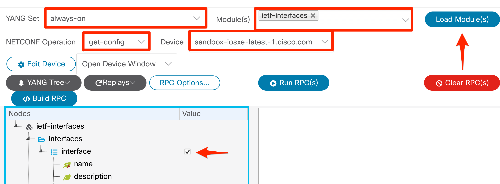
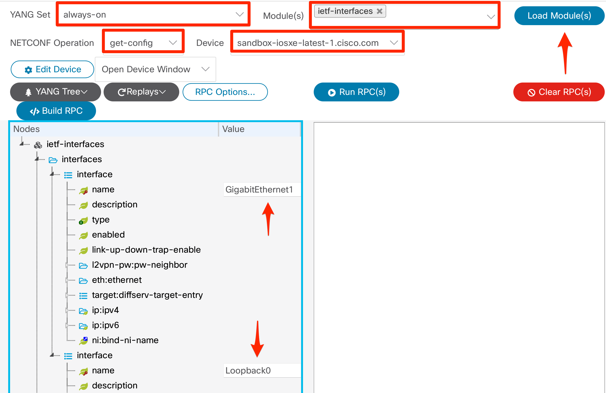
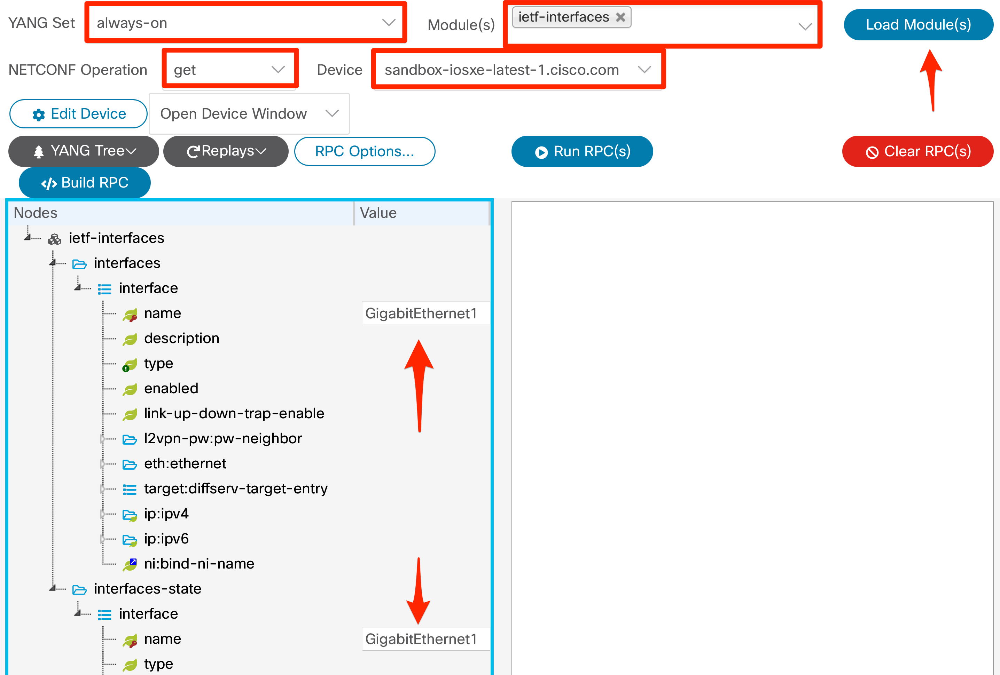
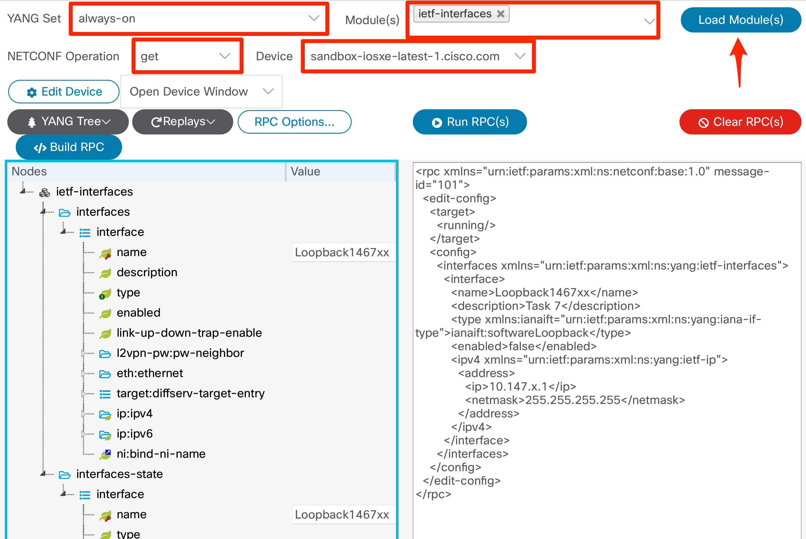
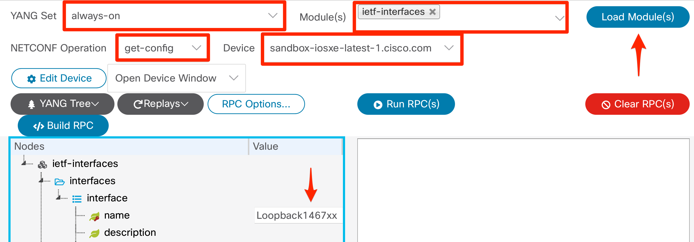
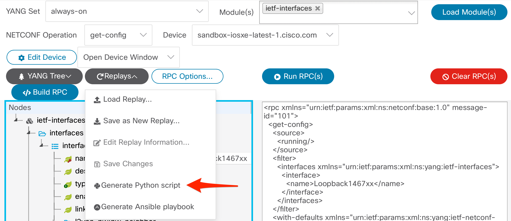

This repo is the companion for a DevNet Workshop delivered at Cisco Live in June of 2023. The workshop leverages Cisco's [yangsuite](https://developer.cisco.com/yangsuite/) to walk through the basics of NETCONF and YANG. A high level lab guide can be found here.

## For Task 1 and 2 open Explore-->YANG from the left hand menu ##

<br>
===================================<br>
<br>

### Task 1 - View a Standard YANG Model as a Tree


<br>

===================================<br>
<br>

### Task 2 - View a Native YANG Model as a Tree


<br>
===================================<br>
<br>

## For the remaing tasks open Protocols-->NETCONF from the left hand menu ##

<br>
===================================<br>
<br>


### Task 3 - Retrieving Device Configuration with NETCONF


1. Change RPC Options to "Explicit - only report default values if explicitly set"
2. Click Build RPC
3. Click Run RPC

<br>
===================================<br>
<br>

### Task 4a - Applying a NETCONF Filter to Retrieve YANG Containers


1. Change RPC Options to "Explicit - only report default values if explicitly set"
2. Click Build RPC
3. Click Run RPC

### Task 4b - Applying a NETCONF Filter to Retrieve Specific List Values


1. Change RPC Options to "Explicit - only report default values if explicitly set"
2. Right click the Interface Container and select "Add another list entry"
3. Enter Loopback Interface 1 and Loopback Interface 2
4. Click Build RPC
5. Click Run RPC

<br>
===================================<br>
<br>


### Task 5 - Retrieving Operational Details with NETCONF


1. Change RPC Options to "Explicit - only report default values if explicitly set"
2. Click Build RPC
3. Click Run RPC

<br>
===================================<br>
<br>

### Task 6 - Edit Configratuion Details with NETCONF


1. Change RPC Options to "Explicit - only report default values if explicitly set"
2. Click Build RPC
3. Click Run RPC


<br>
===================================<br>
<br>

### Task 7 - Edit and Verify Configuration Details with NETCONF

#### SUB TASK 1


1. Change RPC Options to "Explicit - only report default values if explicitly set"
2. Click Build RPC

# DO NOT CLICK RUN RPC

#### SUB TASK 2


1. Click Build RPC

# NOW CLICK RUN RPC

<br>
===================================<br>
<br>

### Task 8 - Auto generate code examples

#### Task 8a #####

1. Change RPC Options to "Explicit - only report default values if explicitly set"
2. Click Build RPC
3. From the Replay drop down select "Generate Python Script"

#### Task 8b ####

1. Change RPC Options to "Explicit - only report default values if explicitly set"
2. Click Build RPC
3. From the Replay drop down select "Generate Ansible Playbook"
4. When prompted name the playbook task_8.yaml

#### Task 8c ####

Optional - from the terminal run and review the python code

``` cat script.py ```

Run the python script:

``` python script.py -a 198.18.133.100 -u admin -p C1sco12345 ```

The output should be XML showing the status of all interfaces currently shutdown.

#### Task 8d ####

Optional - from the terminal run and review the ansible playbook code

``` cat task_8.yaml ```

Run the python script:

``` ansible-playbook task_8.yaml ```

The playbook should complete and show 1 change

#### Task 8e ####


Run the python script and confirm there are no more interfaces in a shutdown state:

``` python script.py -a 198.18.133.100 -u admin -p C1sco12345 ```