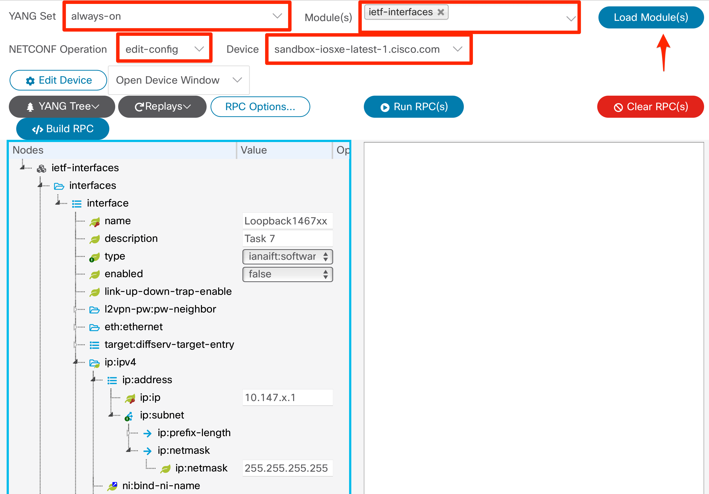

# Welcome to DEVWKS-1467

This repo is the companion for a DevNet Workshop delivered at Cisco Live in June of 2022. The workshop leverages Cisco's yangsuite to walk through the basics of NETCONF and YANG. Basic details on setting up the invironment can be found below. A high level lab guide can be found here.

 
=================================== 
 

### Task 1 - Check the Documentation

 
=================================== 
 

### Task 2 - View a Standard YANG Model as a Tree

 
=================================== 
 

### Task 3 - View a Native YANG Model as a Tree

 
=================================== 
 

### Task 4 - Retrieving Device Configuration with NETCONF

1. Change RPC Options to "Explicit - only report default values if explicitly set"
2. Click Build RPC
3. Click Run RPC

 
=================================== 
 

### Task 5a - Applying a NETCONF Filter to Retrieve YANG Containers

1. Change RPC Options to "Explicit - only report default values if explicitly set"
2. Click Build RPC
3. Click Run RPC

### Task 5b - Applying a NETCONF Filter to Retrieve Specific List Values

1. Change RPC Options to "Explicit - only report default values if explicitly set"
2. Right click the Interface Container and select "Add another list entry"
3. Enter Loopback Interface 1 and Loopback Interface 2
4. Click Build RPC
5. Click Run RPC

 
=================================== 
 

### Task 6 - Retrieving Operational Details with NETCONF

1. Change RPC Options to "Explicit - only report default values if explicitly set"
2. Click Build RPC
3. Click Run RPC

 
=================================== 
 

### Task 7 - Edit Configratuion Details with NETCONF

1. Change RPC Options to "Explicit - only report default values if explicitly set"
2. Click Build RPC
3. Click Run RPC

 
=================================== 
 

### Task 8 - Edit and Verify Configuration Details with NETCONF

#### SUB TASK 1

1. Change RPC Options to "Explicit - only report default values if explicitly set"
2. Click Build RPC

# DO NOT CLICK RUN RPC

#### SUBT TASK 2

1. Click Build RPC

# NOW CLICK RUN RPC
